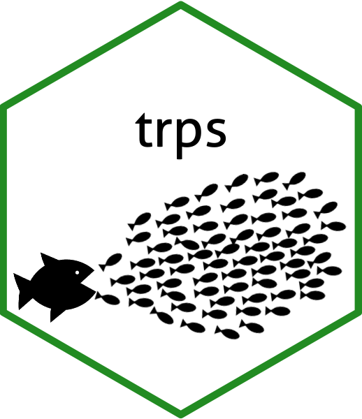

<!-- README.md is generated from README.Rmd. Please edit that file -->

# trps <a href="https://benjaminhlina.github.io/trps/"></a>

<!-- badges: start -->

[](https://lifecycle.r-lib.org/articles/stages.html#experimental)[](https://benjaminhlina.r-universe.dev/trps)[](https://github.com/benjaminhlina/trps/actions/workflows/R-CMD-check.yaml)[](https://app.codecov.io/gh/benjaminhlina/trps)
<!-- badges: end -->

Bayesian trophic position models using stan (pronounced trips) by
leveraging [{brms}](https://paulbuerkner.com/brms/). Equations for
trophic position models are derived from [Post
(2002)](https://esajournals.onlinelibrary.wiley.com/doi/abs/10.1890/0012-9658%282002%29083%5B0703%3AUSITET%5D2.0.CO%3B2),
[Vander Zanden and Vadeboncoeur
(2002)](https://esajournals.onlinelibrary.wiley.com/doi/full/10.1890/0012-9658%282002%29083%5B2152%3AFAIOBA%5D2.0.CO%3B2),
and [Heuvel et
al. (2024)](https://cdnsciencepub.com/doi/10.1139/cjfas-2024-0028) and
are to be used with stable isotope data.

## Trophic Models in {trps}

Currently {trps} supports the following models:

1)  One Source Model - `one_source_model()`

2)  Two Source Model - `two_source_model()`

3)  Two Source Model - $\alpha$ corrected ($\alpha_r$) -
    `two_source_model_ar()`

4)  Two Source Model - $\alpha$ corrected ($\alpha_r$) - carbon mixing
    model - `two_source_model_arc()`

## Installation

You can install the R-Universe version of {trps} using the following:

``` r
install.packages("trps", 
                  repos = c("https://benjaminhlina.r-universe.dev",
                            "https://cloud.r-project.org"))
```

You can install the development version of {trps} using the following:

``` r
devtools::install_github("benjaminhlina/trps")
```

To view the overall progress of the package please see
[news](https://benjaminhlina.github.io/trps/news/index.html).

## Vignettes

I highly suggest going through the vignettes as they will walk you
through how to use each trophic position model using {trps} and {brms}.
The first vignette to walk through is [getting started with
trps](https://benjaminhlina.github.io/trps/articles/trps.html). This
vignette will introduce you to
[{trps}](https://benjaminhlina.github.io/trps/) and methods of how to
estimate trophic position using a one source model. You can access the
vignette by visiting the [get
started](https://benjaminhlina.github.io/trps/articles/trps.html) page
on the website or by using the following code.

``` r
vignette("trps")
```

Please go through [getting started with
trps](https://benjaminhlina.github.io/trps/articles/trps.html) prior to
walking through the other vignettes.

The next vignette will walk you through how to apply
[{trps}](https://benjaminhlina.github.io/trps/) with iterative
processes. This vignette is titled [Estimate Trophic Position - One
Source Model - Multiple
Groups](https://benjaminhlina.github.io/trps/articles/estimate_trophic_position_one_source_multiple_groups.html)
and can be accessed under the article tab on the website or by using the
following code.

``` r
vignette("estimate_trophic_position_one_source_multiple_groups")
```

The last vignette to walk through is [Estimating Trophic Postion - Two
Source
Model](https://benjaminhlina.github.io/trps/articles/estimate_trophic_position_two_source_model.html)
and can be accessed under the article tab on the website or by using the
following code.

``` r
vignette("estimate_trophic_position_two_source_model")
```

To view all of the vignettes you can use following code:

``` r
browseVignettes("trps")
```

## Citations

To cite this package please cite the following publications

- Post, D.M. 2002. Using Stable Isotopes to Estimate Trophic Position:
  Models, Methods, and Assumptions. Ecology 83(3): 703-718. doi:
  [10.2307/3071875](https://esajournals.onlinelibrary.wiley.com/doi/full/10.1890/0012-9658%282002%29083%5B0703%3AUSITET%5D2.0.CO%3B2).

- Vander Zanden, M.J., and Vadeboncoeur, Y. 2002. Fishes as integrators
  of benthic and pelagic food webs in lakes. Ecology 83(8): 2152–2161.
  [link
  here](https://esajournals.onlinelibrary.wiley.com/doi/abs/10.1890/0012-9658(2002)083%5B2152:FAIOBA%5D2.0.CO;2).

- Heuvel, C., Zhao, Y., and Fisk, A.T. 2025. Food web structure across
  basins in Lake Erie, a large freshwater ecosystem. Canadian Journal of
  Fisheries and Aquatic Sciences 82:1-16. doi:
  [10.1139/cjfas-2024-0028](https://cdnsciencepub.com/doi/10.1139/cjfas-2024-0028).

- Hlina B.L. 2025. trps: Bayesian trophic position models using stan. R
  package version 0.1.0 (‘one-skate’).
  <https://benjaminhlina.github.io/trps/>
