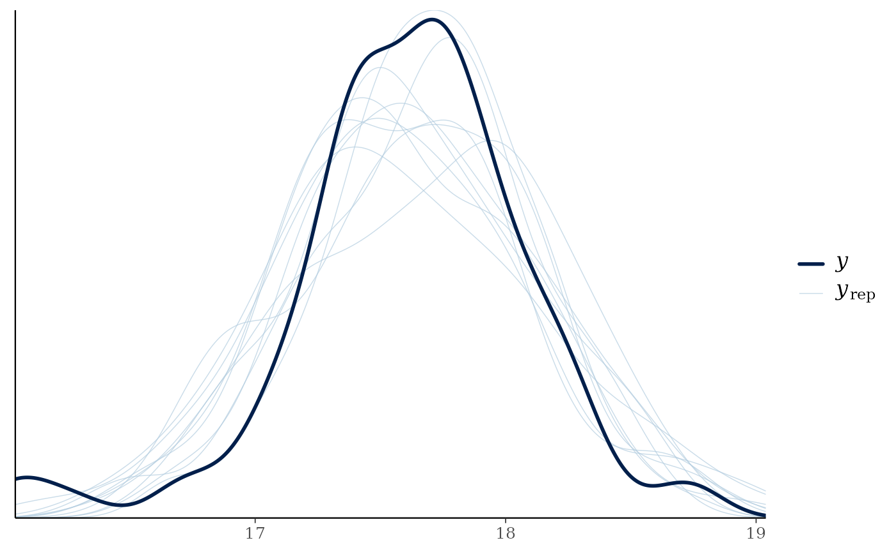
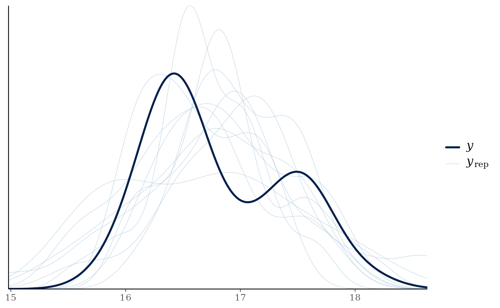

# Estimate Trophic Position - One Source Model - Multiple Groups

## Our Objectives

The purpose of this vignette is to learn how to estimate trophic
position for multiple species or groups using stable isotope data
($\delta^{13}C$ and $\delta^{15}N$). We can estimate trophic position
using a one source model based on equations from [Post
(2002)](https://esajournals.onlinelibrary.wiley.com/doi/abs/10.1890/0012-9658%282002%29083%5B0703%3AUSITET%5D2.0.CO%3B2).

## Trophic Position Model

The equation for a one source model consists of the following:

$$\text{Trophic Position} = \lambda + \frac{\left( \delta^{15}N_{c} - \delta^{15}N_{b} \right)}{\Delta N}$$

Where $\lambda$ is the trophic position of the baseline (e.g., `2`),
$\delta^{15}N_{c}$ is the $\delta^{15}N$ of the consumer,
$\delta^{15}N_{b}$ is the mean $\delta^{15}N$ of the baseline, and
$\Delta N$ is the trophic enrichment factor (e.g., 3.4).

To use this model with a Bayesian framework, we need to rearrange this
equation to the following:

$$\delta^{15}N_{c} = \delta^{15}N_{b} + \Delta N \times \left( \text{Trophic Position} - \lambda \right)$$

The function
[`one_source_model()`](https://benjaminhlina.github.io/trps/reference/one_source_model.md)
uses this rearranged equation.

## Vignette structure

First we need to organize the data prior to running the model. To do
this work we will use [{dplyr}](https://dplyr.tidyverse.org/) and
[{tidyr}](https://tidyr.tidyverse.org/) but we could also use
[{data.table}](https://rdatatable.gitlab.io/data.table/).

When running the model we will use
[{trps}](https://benjaminhlina.github.io/trps/) and
[{brms}](https://paulbuerkner.com/brms/) and iterative processes
provided by [{purrr}](https://purrr.tidyverse.org/).

Once we have run the model we will use
[{bayesplot}](https://mc-stan.org/bayesplot/) to assess models and then
extract posterior draws using
[{tidybayes}](http://mjskay.github.io/tidybayes/). Posterior
distributions will be plotted using
[{ggplot2}](https://ggplot2.tidyverse.org/) and
[{ggdist}](https://mjskay.github.io/ggdist/) with colours provided by
[{viridis}](https://sjmgarnier.github.io/viridis/).

## Load packages

First we load all the packages needed to carry out the analysis.

``` r
{
  library(bayesplot)
  library(brms)
  library(dplyr)
  library(ggplot2)
  library(ggdist)
  library(grid)
  library(purrr)
  library(tidybayes)
  library(tidyr)
  library(trps)
  library(viridis)
}
```

## Working with multiple groups

In [{trps}](https://benjaminhlina.github.io/trps/) we have a data set
that has consumer and baseline data already joined for two ecoregions
(`combined_iso`) using the same methods in [getting started with
trps](https://benjaminhlina.github.io/trps/articles/article/trps.md).
Let’s look at this data frame.

### Organize data - multiple groups

``` r
combined_iso
#> # A tibble: 117 × 13
#>       id common_name ecoregion  d13c  d15n d13c_b1 d15n_b1 d13c_b2 d15n_b2    c1
#>    <int> <fct>       <fct>     <dbl> <dbl>   <dbl>   <dbl>   <dbl>   <dbl> <dbl>
#>  1     1 Lake Trout  Anthropo… -22.3  17.6   -20.3    8.85   -26.4    7.72 -21.3
#>  2     2 Lake Trout  Anthropo… -23.0  17.7   -20.1    8.77   -24.4    8.69 -21.3
#>  3     3 Lake Trout  Anthropo… -21.2  16.7   -20.3    8.85   -24.8    7.99 -21.3
#>  4     4 Lake Trout  Anthropo… -20.9  18.7   -20.1    8.77   -24.4    8.69 -21.3
#>  5     5 Lake Trout  Anthropo… -20.7  18.0   -20.5    8.38   -24.8    7.99 -21.3
#>  6     6 Lake Trout  Anthropo… -20.7  18.0   -20.1    8.34   -24.4    8.05 -21.3
#>  7     7 Lake Trout  Anthropo… -22.8  17.8   -19.7    8.04   -24.1    8.79 -21.3
#>  8     8 Lake Trout  Anthropo… -22.4  17.9   -20.1    8.56   -24.6   10.7  -21.3
#>  9     9 Lake Trout  Anthropo… -20.9  18.4   -18.7    8.95   -24.3   10.6  -21.3
#> 10    10 Lake Trout  Anthropo… -21.7  17.7   -20.8    9.28   -24.6   10.7  -21.3
#> # ℹ 107 more rows
#> # ℹ 3 more variables: n1 <dbl>, c2 <dbl>, n2 <dbl>
```

We can see that this data frame has isotope data for a second baseline
(dreissenids; `d13c_b2` and `d15n_b2`) as well as the mean values for
both baselines (`c1`-`n2`). These columns for the second baseline are
useful when estimating trophic position using a two source model but we
do not need them for this analysis and they can be removed.

We can also confirm that this data set has one species, lake trout.

``` r
unique(combined_iso$common_name)
#> [1] Lake Trout
#> Levels: Lake Trout
```

collected from two ecoregions in Lake Ontario.

``` r
unique(combined_iso$ecoregion)
#> [1] Anthropogenic Embayment    
#> Levels: Anthropogenic Embayment
```

Let’s remove the columns we don’t need, `d13c_b2`, `d15n_b2`, `c2`,
`n2`, and add $\lambda$ to the data frame (`l1`). To do so we make a
`name` column that will be the two groups we have, `common_name` and
`ecoregion` pasted together. We are doing this to make the iterative
processes easier.

``` r
combined_iso_update <- combined_iso %>%
  dplyr::select(-c(d13c_b2, d15n_b2, c2, n2)) %>%
  mutate(
    l1 = 2,
    name = paste(ecoregion, common_name, sep = "_")
  ) %>%
  dplyr::select(id, common_name, ecoregion, name, d13c:l1)
```

Let’s view our completed data set.

``` r
combined_iso_update
#> # A tibble: 117 × 11
#>       id common_name ecoregion     name   d13c  d15n d13c_b1 d15n_b1    c1    n1
#>    <int> <fct>       <fct>         <chr> <dbl> <dbl>   <dbl>   <dbl> <dbl> <dbl>
#>  1     1 Lake Trout  Anthropogenic Anth… -22.3  17.6   -20.3    8.85 -21.3  8.14
#>  2     2 Lake Trout  Anthropogenic Anth… -23.0  17.7   -20.1    8.77 -21.3  8.14
#>  3     3 Lake Trout  Anthropogenic Anth… -21.2  16.7   -20.3    8.85 -21.3  8.14
#>  4     4 Lake Trout  Anthropogenic Anth… -20.9  18.7   -20.1    8.77 -21.3  8.14
#>  5     5 Lake Trout  Anthropogenic Anth… -20.7  18.0   -20.5    8.38 -21.3  8.14
#>  6     6 Lake Trout  Anthropogenic Anth… -20.7  18.0   -20.1    8.34 -21.3  8.14
#>  7     7 Lake Trout  Anthropogenic Anth… -22.8  17.8   -19.7    8.04 -21.3  8.14
#>  8     8 Lake Trout  Anthropogenic Anth… -22.4  17.9   -20.1    8.56 -21.3  8.14
#>  9     9 Lake Trout  Anthropogenic Anth… -20.9  18.4   -18.7    8.95 -21.3  8.14
#> 10    10 Lake Trout  Anthropogenic Anth… -21.7  17.7   -20.8    9.28 -21.3  8.14
#> # ℹ 107 more rows
#> # ℹ 1 more variable: l1 <dbl>
```

This example data is now ready to be analyzed.

## Estimate trophic position - multiple groups

We will use similar structure used in [getting started with
trps](https://benjaminhlina.github.io/trps/articles/article/trps.md) to
model trophic position, however, we first
[`split()`](https://rdrr.io/r/base/split.html) the data into a list for
all groups and then use
[`map()`](https://purrr.tidyverse.org/reference/map.html) from
[{purrr}](https://purrr.tidyverse.org/) to run the model for each group.

You will notice that the
[`brm()`](https://paulbuerkner.com/brms/reference/brm.html) call is
exactly the same as when we ran the model for one group. The only
difference here is when using
[`map()`](https://purrr.tidyverse.org/reference/map.html), the `data`
argument in [`brm()`](https://paulbuerkner.com/brms/reference/brm.html)
needs to be replaced with `.x` to tell
[`brm()`](https://paulbuerkner.com/brms/reference/brm.html) where to get
the data.

### Model - multiple groups

Let’s run the model!

``` r
model_output_os_mg <- combined_iso_update %>%
  split(.$name) %>%
  map(
    ~ brm(
      formula = one_source_model(),
      prior = one_source_priors(),
      stanvars = one_source_priors_params(),
      data = .x,
      family = gaussian(),
      chains = 2,
      iter = 4000,
      warmup = 1000,
      cores = 4,
      seed = 4,
      control = list(adapt_delta = 0.95)
    ),
    .progress = TRUE
  )
#> Compiling Stan program...
#> Start sampling
#>  ■■■■■■■■■■■■■■■■                  50% |  ETA:  1m
#> Compiling Stan program...
#> Start sampling
```

### Model output - multiple groups

Let’s look at the summary of both models.

``` r
model_output_os_mg
#> $`Anthropogenic_Lake Trout`
#>  Family: gaussian 
#>   Links: mu = identity 
#> Formula: d15n ~ n1 + dn * (tp - l1) 
#>          dn ~ 1
#>          tp ~ 1
#>    Data: .x (Number of observations: 87) 
#>   Draws: 2 chains, each with iter = 4000; warmup = 1000; thin = 1;
#>          total post-warmup draws = 6000
#> 
#> Regression Coefficients:
#>              Estimate Est.Error l-95% CI u-95% CI Rhat Bulk_ESS Tail_ESS
#> dn_Intercept     3.38      0.26     2.88     3.87 1.00     1645     1794
#> tp_Intercept     4.82      0.22     4.44     5.29 1.00     1644     1818
#> 
#> Further Distributional Parameters:
#>       Estimate Est.Error l-95% CI u-95% CI Rhat Bulk_ESS Tail_ESS
#> sigma     0.48      0.04     0.42     0.57 1.00     2124     2125
#> 
#> Draws were sampled using sampling(NUTS). For each parameter, Bulk_ESS
#> and Tail_ESS are effective sample size measures, and Rhat is the potential
#> scale reduction factor on split chains (at convergence, Rhat = 1).
#> 
#> $`Embayment_Lake Trout`
#>  Family: gaussian 
#>   Links: mu = identity 
#> Formula: d15n ~ n1 + dn * (tp - l1) 
#>          dn ~ 1
#>          tp ~ 1
#>    Data: .x (Number of observations: 30) 
#>   Draws: 2 chains, each with iter = 4000; warmup = 1000; thin = 1;
#>          total post-warmup draws = 6000
#> 
#> Regression Coefficients:
#>              Estimate Est.Error l-95% CI u-95% CI Rhat Bulk_ESS Tail_ESS
#> dn_Intercept     3.37      0.25     2.89     3.86 1.00     1506     1878
#> tp_Intercept     4.54      0.20     4.21     4.96 1.00     1531     1891
#> 
#> Further Distributional Parameters:
#>       Estimate Est.Error l-95% CI u-95% CI Rhat Bulk_ESS Tail_ESS
#> sigma     0.61      0.09     0.47     0.81 1.00     2145     1903
#> 
#> Draws were sampled using sampling(NUTS). For each parameter, Bulk_ESS
#> and Tail_ESS are effective sample size measures, and Rhat is the potential
#> scale reduction factor on split chains (at convergence, Rhat = 1).
```

We can see that $\widehat{R}$ is 1, meaning that the variance among and
within chains are equal (see [{rstan} docmentation on
$\widehat{R}$](https://mc-stan.org/rstan/reference/Rhat.html)) and that
ESS is quite large for both groups. Overall, this means that both models
are converging and fitting accordingly.

### Trace plots - multiple groups

Let’s look at the trace plots and distributions. We use
[`iwalk()`](https://purrr.tidyverse.org/reference/imap.html) instead of
[`map()`](https://purrr.tidyverse.org/reference/map.html), as
[`iwalk()`](https://purrr.tidyverse.org/reference/imap.html) invisibly
returns `.x` which is handy when you want to call a function (e.g.,
[`plot()`](https://rdrr.io/r/graphics/plot.default.html)) for its side
effects rather than its returned value. I have also added
[`grid.text()`](https://rdrr.io/r/grid/grid.text.html) from `{grid}` to
add the group names to each plot.

``` r
model_output_os_mg %>%
  iwalk(~ {
    plot(.x)
    grid.text(.y, x = 0.50, y = 0.98)
  })
```


We can see that the trace plots look “grassy” meaning the model is
converging!

## Posterior draws - multiple groups

Let’s again look at the summary output from the model.

``` r
model_output_os_mg
#> $`Anthropogenic_Lake Trout`
#>  Family: gaussian 
#>   Links: mu = identity 
#> Formula: d15n ~ n1 + dn * (tp - l1) 
#>          dn ~ 1
#>          tp ~ 1
#>    Data: .x (Number of observations: 87) 
#>   Draws: 2 chains, each with iter = 4000; warmup = 1000; thin = 1;
#>          total post-warmup draws = 6000
#> 
#> Regression Coefficients:
#>              Estimate Est.Error l-95% CI u-95% CI Rhat Bulk_ESS Tail_ESS
#> dn_Intercept     3.38      0.26     2.88     3.87 1.00     1645     1794
#> tp_Intercept     4.82      0.22     4.44     5.29 1.00     1644     1818
#> 
#> Further Distributional Parameters:
#>       Estimate Est.Error l-95% CI u-95% CI Rhat Bulk_ESS Tail_ESS
#> sigma     0.48      0.04     0.42     0.57 1.00     2124     2125
#> 
#> Draws were sampled using sampling(NUTS). For each parameter, Bulk_ESS
#> and Tail_ESS are effective sample size measures, and Rhat is the potential
#> scale reduction factor on split chains (at convergence, Rhat = 1).
#> 
#> $`Embayment_Lake Trout`
#>  Family: gaussian 
#>   Links: mu = identity 
#> Formula: d15n ~ n1 + dn * (tp - l1) 
#>          dn ~ 1
#>          tp ~ 1
#>    Data: .x (Number of observations: 30) 
#>   Draws: 2 chains, each with iter = 4000; warmup = 1000; thin = 1;
#>          total post-warmup draws = 6000
#> 
#> Regression Coefficients:
#>              Estimate Est.Error l-95% CI u-95% CI Rhat Bulk_ESS Tail_ESS
#> dn_Intercept     3.37      0.25     2.89     3.86 1.00     1506     1878
#> tp_Intercept     4.54      0.20     4.21     4.96 1.00     1531     1891
#> 
#> Further Distributional Parameters:
#>       Estimate Est.Error l-95% CI u-95% CI Rhat Bulk_ESS Tail_ESS
#> sigma     0.61      0.09     0.47     0.81 1.00     2145     1903
#> 
#> Draws were sampled using sampling(NUTS). For each parameter, Bulk_ESS
#> and Tail_ESS are effective sample size measures, and Rhat is the potential
#> scale reduction factor on split chains (at convergence, Rhat = 1).
```

We can see that, for lake trout from the `Anthropogenic` ecoregion,
$\Delta N$ is estimated to be `3.38` with `l-95% CI` of `2.88`, and
`u-95% CI` of `3.87`. If we move down to trophic position (`tp`) we see
trophic position is estimated to be `4.82` with `l-95% CI` of `4.44`,
and `u-95% CI` of `5.29`.

We can see that, for lake trout from the `Embayment` ecoregion,
$\Delta N$ is estimated to be `3.37` with `l-95% CI` of `2.89`, and
`u-95% CI` of `3.86`. If we move down to trophic position (`tp`) we see
trophic position is estimated to be `4.54` with `l-95% CI` of `4.21`,
and `u-95% CI` of `4.96`.

## Predictive posterior check

We can check how well the model is predicting the $\delta^{15}N$ of the
consumer using
[`pp_check()`](https://mc-stan.org/bayesplot/reference/pp_check.html)
from [bayesplot](https://mc-stan.org/bayesplot/). We have to use
[`map()`](https://purrr.tidyverse.org/reference/map.html) from
[purrr](https://purrr.tidyverse.org/) to iterate over the list that has
our model objects.

``` r
model_output_os_mg %>%
  map(~ .x %>%
    pp_check())
#> Using 10 posterior draws for ppc type 'dens_overlay' by default.
#> Using 10 posterior draws for ppc type 'dens_overlay' by default.
#> $`Anthropogenic_Lake Trout`
```



    #> 
    #> $`Embayment_Lake Trout`



We can see that posteriors draws ($y_{rep}$; light lines) for both
groups are are effectively modeling $\delta^{15}N$ of the consumer ($y$;
dark line).

## Extract posterior draws - multiple groups

We use functions from [{tidybayes}](http://mjskay.github.io/tidybayes/)
to do this work. First we look at the the names of the variables we want
to extract using
[`get_variables()`](https://mjskay.github.io/tidybayes/reference/get_variables.html).
Considering we have multiple models in `model_output_os_mg` that all
have the same structure, we can just look at the names of the first
model object in `model_output_os_mg`.

``` r
get_variables(model_output_os_mg[[1]])
#>  [1] "b_dn_Intercept" "b_tp_Intercept" "sigma"          "lprior"        
#>  [5] "lp__"           "accept_stat__"  "stepsize__"     "treedepth__"   
#>  [9] "n_leapfrog__"   "divergent__"    "energy__"
```

You will notice that `"b_tp_Intercept"` is the name of the variable that
we are wanting to extract. Next we extract posterior draws using
[`gather_draws()`](https://mjskay.github.io/tidybayes/reference/spread_draws.html),
and rename `"b_tp_Intercept"` to `tp`.

Again, considering we have multiple models in `model_output_os_mg` we
need to use [`map()`](https://purrr.tidyverse.org/reference/map.html) to
iterate over `model_output_os_mg` to get the posterior draws. Once we
have iterated over `model_output_os_mg` to extract draws we can combine
the results using
[`bind_rows()`](https://dplyr.tidyverse.org/reference/bind_rows.html)
from [{dplyr}](https://dplyr.tidyverse.org/). The variable `name` will
have the name of the ecoregion and common name of the species pasted to
together by a `_`. We need to separate this string into the two
variables we want, being `ecoregion` and `common_name`. We can do this
by using
[`separate_wider_delim()`](https://tidyr.tidyverse.org/reference/separate_wider_delim.html)
from [{tidyr}](https://tidyr.tidyverse.org/). When using this function
it will separate the columns and keep them as `characters`, hence why
the last step is to convert `ecoregion` into a `factor`.

For your data you will likely have category names other than `ecoregion`
and `common_name`. Please replace with the columns that fit your data
structure.

``` r
post_draws_mg <- model_output_os_mg %>%
  map(~ .x %>%
    gather_draws(b_tp_Intercept) %>%
    mutate(
      .variable = "tp"
    ) %>%
    ungroup()) %>%
  bind_rows(.id = "name") %>%
  separate_wider_delim(name,
    names = c("ecoregion", "common_name"),
    delim = "_", cols_remove = FALSE
  ) %>%
  mutate(
    ecoregion = factor(ecoregion,
      levels = c("Anthropogenic", "Embayment")
    ),
  )
```

Let’s view the `post_draws_mg`

``` r
post_draws_mg
#> # A tibble: 12,000 × 8
#>    ecoregion     common_name name       .chain .iteration .draw .variable .value
#>    <fct>         <chr>       <chr>       <int>      <int> <int> <chr>      <dbl>
#>  1 Anthropogenic Lake Trout  Anthropog…      1          1     1 tp          4.49
#>  2 Anthropogenic Lake Trout  Anthropog…      1          2     2 tp          4.90
#>  3 Anthropogenic Lake Trout  Anthropog…      1          3     3 tp          4.74
#>  4 Anthropogenic Lake Trout  Anthropog…      1          4     4 tp          4.87
#>  5 Anthropogenic Lake Trout  Anthropog…      1          5     5 tp          4.86
#>  6 Anthropogenic Lake Trout  Anthropog…      1          6     6 tp          5.17
#>  7 Anthropogenic Lake Trout  Anthropog…      1          7     7 tp          5.16
#>  8 Anthropogenic Lake Trout  Anthropog…      1          8     8 tp          5.11
#>  9 Anthropogenic Lake Trout  Anthropog…      1          9     9 tp          4.94
#> 10 Anthropogenic Lake Trout  Anthropog…      1         10    10 tp          4.95
#> # ℹ 11,990 more rows
```

We can see that the posterior draws data frame consists of seven
variables:

1.  `ecoregion`
2.  `common_name`
3.  `.chain`
4.  `.iteration` (number of samples after burn-in)
5.  `.draw` (number of samples from `iter`)
6.  `.variable` (this will have different variables depending on what is
    supplied to
    [`gather_draws()`](https://mjskay.github.io/tidybayes/reference/spread_draws.html))
7.  `.value` (estimated value)

Note - the names of and items in the first two columns will vary
depending on the names you split your data into.

## Extracting credible intervals - multiple groups

Considering we are likely using this information for a paper or
presentation, it is nice to be able to report the median and credible
intervals (e.g., equal-tailed intervals; ETI). We can extract and export
these values using
[`spread_draws()`](https://mjskay.github.io/tidybayes/reference/spread_draws.html)
and `median_qi` from [{tidybayes}](http://mjskay.github.io/tidybayes/).

Again, because `model_output_os_mg` is a `list` of our model objects, we
need to [`map()`](https://purrr.tidyverse.org/reference/map.html) over
the list to calculate these values. Then we do the same procedures we
have done before to combine and restructure the outputs. Lastly, we use
[`mutate_if()`](https://dplyr.tidyverse.org/reference/mutate_all.html)
to round all columns that are numeric to two decimal points.

``` r
post_medians_ci <- model_output_os_mg %>%
  map(~ .x %>%
    spread_draws(b_tp_Intercept) %>%
    median_qi() %>%
    rename(
      tp = b_tp_Intercept
    )) %>%
  bind_rows(.id = "name") %>%
  separate_wider_delim(name,
    names = c("ecoregion", "common_name"),
    delim = "_", cols_remove = FALSE
  ) %>%
  mutate(
    ecoregion = factor(ecoregion,
      levels = c("Anthropogenic", "Embayment")
    ),
  ) %>%
  mutate_if(is.numeric, round, digits = 2)
```

Let’s view the output.

``` r
post_medians_ci
#> # A tibble: 2 × 9
#>   ecoregion     common_name name        tp .lower .upper .width .point .interval
#>   <fct>         <chr>       <chr>    <dbl>  <dbl>  <dbl>  <dbl> <chr>  <chr>    
#> 1 Anthropogenic Lake Trout  Anthrop…  4.81   4.44   5.29   0.95 median qi       
#> 2 Embayment     Lake Trout  Embayme…  4.53   4.21   4.96   0.95 median qi
```

I like to use [{openxlsx}](https://ycphs.github.io/openxlsx/index.html)
to export these values into a table that I can use for presentations and
papers. For the vignette I am not going to demonstrate how to do this
but please check out
[openxlsx](https://ycphs.github.io/openxlsx/index.html).

## Plotting posterior distributions - multiple groups

Now that we have our posterior draws extracted we can plot them. For
comparing trophic position among species or groups, I like using either
violin plots, interval points, or slab plots for posteriors. We can
access violins through [{ggplot2}](https://ggplot2.tidyverse.org/) with
the later being available in
[{ggdist}](https://mjskay.github.io/ggdist/).

### Violin plot

Let’s first look at the violin plot.

``` r
ggplot(data = post_draws_mg, aes(
  x = common_name,
  y = .value,
  fill = ecoregion
)) +
  geom_violin() +
  stat_summary(
    fun = median, geom = "point",
    size = 3,
    position = position_dodge(0.9)
  ) +
  scale_fill_viridis_d(
    name = "Ecoregion",
    option = "G",
    begin = 0.35,
    end = 0.75, alpha = 0.65
  ) +
  theme_bw(base_size = 15) +
  theme(
    panel.grid = element_blank(),
    legend.position = "inside",
    legend.position.inside = c(0.85, 0.86)
  ) +
  labs(
    x = "Species",
    y = "P(Trophic Position | X)"
  )
```


### Point interval plot

Next, we’ll look at the point interval plot – but first we need to
create our colour palette.

``` r
viridis_colours <- viridis(2,
  option = "G",
  begin = 0.35,
  end = 0.75,
  alpha = 0.65
)
```

Now let’s plot the point intervals.

``` r
ggplot(data = post_draws_mg, aes(
  x = common_name,
  y = .value,
  group = ecoregion
)) +
  stat_pointinterval(
    aes(point_fill = ecoregion),
    point_size = 4,
    interval_colour = "grey60",
    position = position_dodge(0.4),
    shape = 21,
  ) +
  scale_fill_manual(
    aesthetics = "point_fill",
    values = viridis_colours,
    name = "Ecoregion"
  ) +
  theme_bw(base_size = 15) +
  theme(
    panel.grid = element_blank(),
    legend.position = "inside",
    legend.position.inside = c(0.85, 0.86)
  ) +
  labs(
    x = "Species",
    y = "P(Trophic Position | X)"
  )
```


Congratulations we have successfully run a Bayesian one source trophic
position model for one species in two ecoregions of Lake Ontario!
