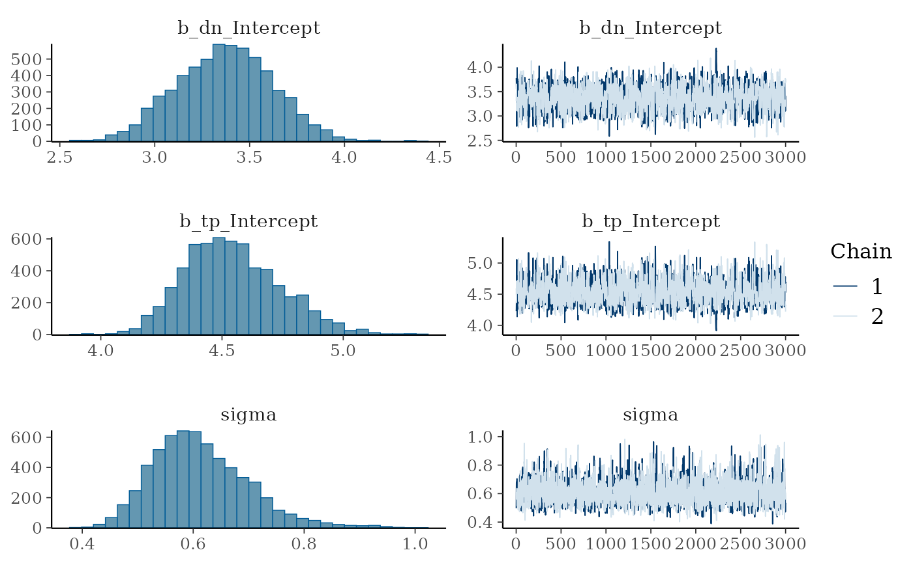
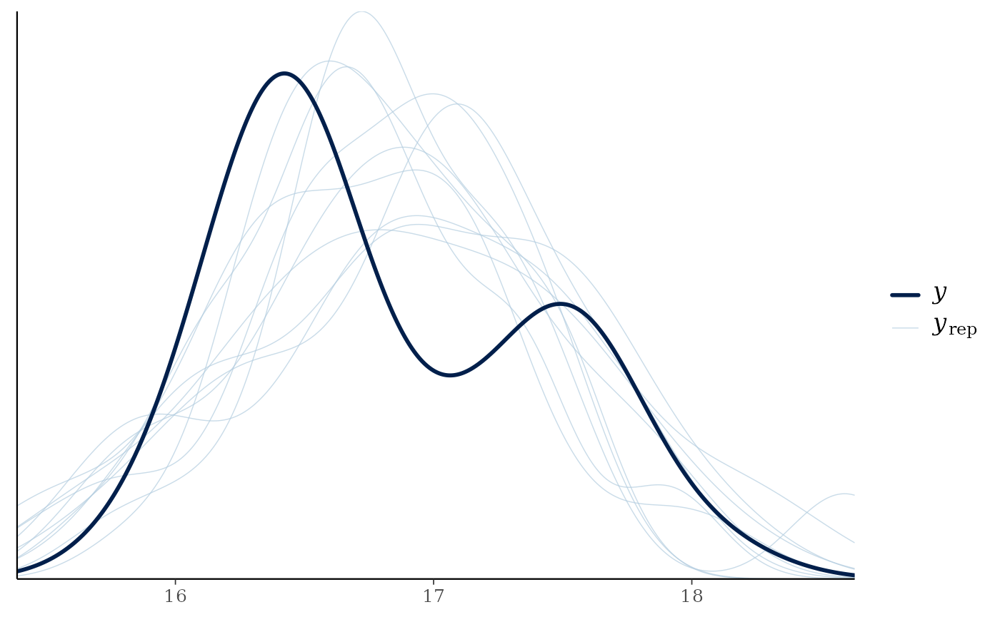

# Getting started with trps

## Our Objectives

The purpose of this vignette is to learn how to estimate trophic
position of a species using stable isotope data ($\delta^{13}C$ and
$\delta^{15}N$). We can estimate trophic position using several
different models but for the purpose of getting started a one source
model is the simplest and easiest to implement. The one source model is
based on equations from [Post
(2002)](https://esajournals.onlinelibrary.wiley.com/doi/abs/10.1890/0012-9658%282002%29083%5B0703%3AUSITET%5D2.0.CO%3B2).

If you are wanting to use other trophic position models please walk
through this vignette and then check out those vignettes under the
[article section](https://benjaminhlina.github.io/trps/articles/) of the
webpage.

## Trophic Position Model

The equation for a one source model consists of the following:

$$\text{Trophic Position} = \lambda + \frac{\left( \delta^{15}N_{c} - \delta^{15}N_{b} \right)}{\Delta N}$$

Where $\lambda$ is the trophic position of the baseline (e.g., `2`),
$\delta^{15}N_{c}$ is the $\delta^{15}N$ of the consumer,
$\delta^{15}N_{b}$ is the mean $\delta^{15}N$ of the baseline, and
$\Delta N$ is the trophic enrichment factor (e.g., 3.4).

To use this model with a Bayesian framework, we need to rearrange this
equation to the following:

$$\delta^{15}N_{c} = \delta^{15}N_{b} + \Delta N \times \left( \text{Trophic Position} - \lambda \right)$$

The function
[`one_source_model()`](https://benjaminhlina.github.io/trps/reference/one_source_model.md)
uses this rearranged equation.

## Vignette structure

First we need to organize the data prior to running the model. To do
this work we will use [{dplyr}](https://dplyr.tidyverse.org/) and
[{tidyr}](https://tidyr.tidyverse.org/) but we could also use
[{data.table}](https://rdatatable.gitlab.io/data.table/).

When running the model we will use
[{trps}](https://benjaminhlina.github.io/trps/) and
[{brms}](https://paulbuerkner.com/brms/).

Once we have run the model we will use
[{bayesplot}](https://mc-stan.org/bayesplot/) to assess models and then
extract posterior draws using
[{tidybayes}](http://mjskay.github.io/tidybayes/). Posterior
distributions will be plotted using
[{ggplot2}](https://ggplot2.tidyverse.org/) and
[{ggdist}](https://mjskay.github.io/ggdist/) with colours provided by
[{viridis}](https://sjmgarnier.github.io/viridis/).

## Load packages

First we load all the packages needed to carry out the analysis.

``` r
{
  library(bayesplot)
  library(brms)
  library(dplyr)
  library(ggplot2)
  library(ggdist)
  library(grid)
  library(tidybayes)
  library(tidyr)
  library(trps)
  library(viridis)
}
```

## Assess data

In [{trps}](https://benjaminhlina.github.io/trps/) we have several data
sets, they include stable isotope data ($\delta^{13}C$ and
$\delta^{15}N$) for a consumer, lake trout (*Salvelinus namaycush*), a
benthic baseline, amphipods, and a pelagic baseline, dreissenids, for an
ecoregion in Lake Ontario.

### Consumer data

We check out each data set with the first being the consumer.

``` r
consumer_iso
#> # A tibble: 30 × 4
#>    common_name ecoregion  d13c  d15n
#>    <fct>       <fct>     <dbl> <dbl>
#>  1 Lake Trout  Embayment -22.9  15.9
#>  2 Lake Trout  Embayment -22.5  16.2
#>  3 Lake Trout  Embayment -22.8  17.0
#>  4 Lake Trout  Embayment -22.3  16.6
#>  5 Lake Trout  Embayment -22.5  16.6
#>  6 Lake Trout  Embayment -22.3  16.6
#>  7 Lake Trout  Embayment -22.3  16.6
#>  8 Lake Trout  Embayment -22.5  16.2
#>  9 Lake Trout  Embayment -22.9  16.4
#> 10 Lake Trout  Embayment -22.3  16.3
#> # ℹ 20 more rows
```

We can see that this data set contains the `common_name` of the consumer
, the `ecoregion` samples were collected from, and $\delta^{13}C$
(`d13c`) and $\delta^{15}N$ (`d15n`).

### Baseline data

Next we check out the benthic baseline data set.

``` r
baseline_1_iso
#> # A tibble: 36 × 4
#>    common_name ecoregion     d13c_b1 d15n_b1
#>    <fct>       <fct>           <dbl>   <dbl>
#>  1 Amphipoda   Anthropogenic   -20.3    8.85
#>  2 Amphipoda   Anthropogenic   -20.1    8.77
#>  3 Amphipoda   Anthropogenic   -20.3    8.85
#>  4 Amphipoda   Anthropogenic   -20.1    8.77
#>  5 Amphipoda   Anthropogenic   -20.5    8.38
#>  6 Amphipoda   Anthropogenic   -20.1    8.34
#>  7 Amphipoda   Anthropogenic   -19.7    8.04
#>  8 Amphipoda   Anthropogenic   -20.1    8.56
#>  9 Amphipoda   Anthropogenic   -18.7    8.95
#> 10 Amphipoda   Anthropogenic   -20.8    9.28
#> # ℹ 26 more rows
```

We can see that this data set contains the `common_name` of the
baseline, the `ecoregion` samples were collected from, and
$\delta^{13}C$ (`d13c_b1`) and $\delta^{15}N$ (`d15n_b1`).

## Organizing data

Now that we understand the data we need to combine both data sets to
estimate trophic position for our consumer.

To do this we first need to make an `id` column in each data set, which
will allow us to join them together. We first
[`arrange()`](https://dplyr.tidyverse.org/reference/arrange.html) the
data by `ecoregion` and `common_name`. Next we
[`group_by()`](https://dplyr.tidyverse.org/reference/group_by.html) the
same variables, and add `id` for each grouping using
[`row_number()`](https://dplyr.tidyverse.org/reference/row_number.html).
Always
[`ungroup()`](https://dplyr.tidyverse.org/reference/group_by.html) the
`data.frame` after using
[`group_by()`](https://dplyr.tidyverse.org/reference/group_by.html).
Lastly, we use
[`dplyr::select()`](https://dplyr.tidyverse.org/reference/select.html)
to rearrange the order of the columns.

### Consumer data

Let’s first add `id` to `consumer_iso` data frame.

``` r
con_os <- consumer_iso %>%
  arrange(ecoregion, common_name) %>%
  group_by(ecoregion, common_name) %>%
  mutate(
    id = row_number()
  ) %>%
  ungroup() %>%
  dplyr::select(id, common_name:d15n)
```

You will notice that I have renamed this object to `con_os` this is
because we are modifying `con_os`. I have done the same to the baseline
and combined objects below.

### Baseline data

Next let’s add `id` to `baseline_1_iso` data frame. For joining purposes
we are going to drop `common_name` from this data frame.

``` r
b1_os <- baseline_1_iso %>%
  arrange(ecoregion, common_name) %>%
  group_by(ecoregion, common_name) %>%
  mutate(
    id = row_number()
  ) %>%
  ungroup() %>%
  dplyr::select(id, ecoregion:d15n_b1)
```

### Joining isotope data

Now that we have the consumer and baseline data sets in a consistent
format we can join them by `"id"` and `"ecoregion"` using
[`left_join()`](https://dplyr.tidyverse.org/reference/mutate-joins.html)
from [{dplyr}](https://dplyr.tidyverse.org/).

``` r
combined_iso_os <- con_os %>%
  left_join(b1_os, by = c("id", "ecoregion"))
```

We can see that we have successfully combined our consumer and baseline
data. We need to do one last thing prior to analyzing the data, and that
is calculate the mean $\delta^{13}C$ (`c1`) and $\delta^{15}N$ (`n1`)
for the baseline and add in the constant $\lambda$ (`l1`) to our data
frame. We do this by using `groub_by()` to group the data by our two
groups, then using
[`mutate()`](https://dplyr.tidyverse.org/reference/mutate.html) and
[`mean()`](https://rdrr.io/r/base/mean.html) to calculate the mean
values.

Important note, to run the model successfully, columns need to be named
`d15n`, `n1`, and `l1`.

``` r
combined_iso_os_1 <- combined_iso_os %>%
  group_by(ecoregion, common_name) %>%
  mutate(
    c1 = mean(d13c_b1, na.rm = TRUE),
    n1 = mean(d15n_b1, na.rm = TRUE),
    l1 = 2
  ) %>%
  ungroup()
```

Let’s view our combined data.

``` r
combined_iso_os_1
#> # A tibble: 30 × 10
#>       id common_name ecoregion  d13c  d15n d13c_b1 d15n_b1    c1    n1    l1
#>    <int> <fct>       <fct>     <dbl> <dbl>   <dbl>   <dbl> <dbl> <dbl> <dbl>
#>  1     1 Lake Trout  Embayment -22.9  15.9   -26.2    8.44 -24.6  8.28     2
#>  2     2 Lake Trout  Embayment -22.5  16.2   -26.6    8.77 -24.6  8.28     2
#>  3     3 Lake Trout  Embayment -22.8  17.0   -26.0    8.05 -24.6  8.28     2
#>  4     4 Lake Trout  Embayment -22.3  16.6   -22.1   13.6  -24.6  8.28     2
#>  5     5 Lake Trout  Embayment -22.5  16.6   -24.3    6.99 -24.6  8.28     2
#>  6     6 Lake Trout  Embayment -22.3  16.6   -22.1    7.95 -24.6  8.28     2
#>  7     7 Lake Trout  Embayment -22.3  16.6   -24.7    7.37 -24.6  8.28     2
#>  8     8 Lake Trout  Embayment -22.5  16.2   -26.6    6.93 -24.6  8.28     2
#>  9     9 Lake Trout  Embayment -22.9  16.4   -24.6    6.97 -24.6  8.28     2
#> 10    10 Lake Trout  Embayment -22.3  16.3   -22.1    7.95 -24.6  8.28     2
#> # ℹ 20 more rows
```

It is now ready to be analyzed!

## Bayesian Analysis

We can now estimate trophic position for lake trout in an ecoregion of
Lake Ontario.

There are a few things to know about running a Bayesian analysis, I
suggest reading these resources:

1.  [Basics of Bayesian Statistics -
    Book](https://statswithr.github.io/book/)
2.  [General Introduction to
    brms](https://www.jstatsoft.org/article/view/v080i01)
3.  [Estimating non-linear models with
    brms](https://paulbuerkner.com/brms/articles/brms_nonlinear.html)
4.  [Nonlinear modelling using nls nlme and
    brms](https://www.granvillematheson.com/post/nonlinear-modelling-using-nls-nlme-and-brms/)
5.  [Andrew Proctor’s - Module
    6](https://andrewproctor.github.io/rcourse/module6.html)
6.  [van de Schoot et al.,
    (2021)](https://www.nature.com/articles/s43586-020-00001-2)

### Priors

Bayesian analyses rely on supplying uninformed or informed prior
distributions for each parameter (coefficient; predictor) in the model.
The default informed priors for a one source model are the following,
$\Delta N$ assumes a normal distribution (`dn`; $\mu = 3.4$;
$\sigma = 0.25$), trophic position assumes a uniform distribution (lower
bound = 2 and upper bound = 10), $\sigma$ assumes a uniform distribution
(lower bound = 0 and upper bound = 10), and if informed priors are
desired for $\delta^{15}N_{b}$ (`n1`; $\mu = 9$; $\sigma = 1$), we can
set the argument `bp` to `TRUE` in all `one_source_` functions.

You can change these default priors using
[`one_source_priors_params()`](https://benjaminhlina.github.io/trps/reference/one_source_priors_params.md),
however, I would suggest becoming familiar with Bayesian analyses, your
study species, and system prior to adjusting these values.

### Model convergence

It is important to always run the model with at least 2 chains. If the
model does not converge you can try to increase the following:

1.  The amount of samples that are burned-in (discarded; in
    [`brm()`](https://paulbuerkner.com/brms/reference/brm.html) this can
    be controlled by the argument `warmup`)

2.  The number of iterative samples retained (in
    [`brm()`](https://paulbuerkner.com/brms/reference/brm.html) this can
    be controlled by the argument `iter`).

3.  The number of samples drawn (in
    [`brm()`](https://paulbuerkner.com/brms/reference/brm.html) this is
    controlled by the argument `thin`).

4.  The `adapt_delta` value using `control = list(adapt_delta = 0.95)`.

When assessing the model we want $\widehat{R}$ to be 1 or within 0.05 of
1, which indicates that the variance among and within chains are equal
(see [{rstan} documentation on
$\widehat{R}$](https://mc-stan.org/rstan/reference/Rhat.html)), a high
value for effective sample size (ESS), trace plots to look “grassy” or
“caterpillar like,” and posterior distributions to look relatively
normal.

## Estimating trophic position

We will use functions from
[{trps}](https://benjaminhlina.github.io/trps/) that drop into a
[{brms}](https://paulbuerkner.com/brms/) model. These functions are
[`one_source_model()`](https://benjaminhlina.github.io/trps/reference/one_source_model.md)
which provides
[`brm()`](https://paulbuerkner.com/brms/reference/brm.html) the formula
structure needed to run a one source model. Next
[`brm()`](https://paulbuerkner.com/brms/reference/brm.html) needs the
structure of the priors which is supplied to the `prior` argument using
[`one_source_priors()`](https://benjaminhlina.github.io/trps/reference/one_source_priors.md).
Lastly, values for these priors are supplied through the `stanvars`
argument using
[`one_source_priors_params()`](https://benjaminhlina.github.io/trps/reference/one_source_priors_params.md).
You can adjust the mean ($\mu$), variance ($\sigma$), or upper and lower
bounds (`lb` and `ub`) for each prior of the model using
[`one_source_priors_params()`](https://benjaminhlina.github.io/trps/reference/one_source_priors_params.md),
however, only adjust priors if you have a good grasp of Bayesian
frameworks and your study system and species.

### Model

Let’s run the model!

``` r
model_output_os <- brm(
  formula = one_source_model(),
  prior = one_source_priors(),
  stanvars = one_source_priors_params(),
  data = combined_iso_os_1,
  family = gaussian(),
  chains = 2,
  iter = 4000,
  warmup = 1000,
  cores = 4,
  seed = 4,
  control = list(adapt_delta = 0.95)
)
#> Compiling Stan program...
#> Start sampling
```

### Model output

Let’s view the summary of the model.

``` r
model_output_os
#>  Family: gaussian 
#>   Links: mu = identity 
#> Formula: d15n ~ n1 + dn * (tp - l1) 
#>          dn ~ 1
#>          tp ~ 1
#>    Data: combined_iso_os_1 (Number of observations: 30) 
#>   Draws: 2 chains, each with iter = 4000; warmup = 1000; thin = 1;
#>          total post-warmup draws = 6000
#> 
#> Regression Coefficients:
#>              Estimate Est.Error l-95% CI u-95% CI Rhat Bulk_ESS Tail_ESS
#> dn_Intercept     3.37      0.25     2.89     3.86 1.00     1506     1878
#> tp_Intercept     4.54      0.20     4.21     4.96 1.00     1531     1891
#> 
#> Further Distributional Parameters:
#>       Estimate Est.Error l-95% CI u-95% CI Rhat Bulk_ESS Tail_ESS
#> sigma     0.61      0.09     0.47     0.81 1.00     2145     1903
#> 
#> Draws were sampled using sampling(NUTS). For each parameter, Bulk_ESS
#> and Tail_ESS are effective sample size measures, and Rhat is the potential
#> scale reduction factor on split chains (at convergence, Rhat = 1).
```

We can see that $\widehat{R}$ is 1 meaning that variance among and
within chains are equal (see [{rstan} documentation on
$\widehat{R}$](https://mc-stan.org/rstan/reference/Rhat.html)) and that
ESS is quite large. Overall, this means the model is converging and
fitting accordingly.

### Trace plots

Let’s view trace plots and posterior distributions for the model.

``` r
plot(model_output_os)
```



We can see that the trace plots look “grassy” meaning the model is
converging!

## Predictive posterior check

We can check how well the model is predicting the $\delta^{15}N$ of the
consumer using
[`pp_check()`](https://mc-stan.org/bayesplot/reference/pp_check.html)
from [bayesplot](https://mc-stan.org/bayesplot/).

``` r
pp_check(model_output_os)
#> Using 10 posterior draws for ppc type 'dens_overlay' by default.
```



We can see that posteriors draws ($y_{rep}$; light lines) are
effectively modeling $\delta^{15}N$ of the consumer ($y$; dark line).

## Posterior draws

Let’s again look at the summary output from the model.

``` r
model_output_os
#>  Family: gaussian 
#>   Links: mu = identity 
#> Formula: d15n ~ n1 + dn * (tp - l1) 
#>          dn ~ 1
#>          tp ~ 1
#>    Data: combined_iso_os_1 (Number of observations: 30) 
#>   Draws: 2 chains, each with iter = 4000; warmup = 1000; thin = 1;
#>          total post-warmup draws = 6000
#> 
#> Regression Coefficients:
#>              Estimate Est.Error l-95% CI u-95% CI Rhat Bulk_ESS Tail_ESS
#> dn_Intercept     3.37      0.25     2.89     3.86 1.00     1506     1878
#> tp_Intercept     4.54      0.20     4.21     4.96 1.00     1531     1891
#> 
#> Further Distributional Parameters:
#>       Estimate Est.Error l-95% CI u-95% CI Rhat Bulk_ESS Tail_ESS
#> sigma     0.61      0.09     0.47     0.81 1.00     2145     1903
#> 
#> Draws were sampled using sampling(NUTS). For each parameter, Bulk_ESS
#> and Tail_ESS are effective sample size measures, and Rhat is the potential
#> scale reduction factor on split chains (at convergence, Rhat = 1).
```

We can see that $\Delta N$ is estimated to be `3.37` with `l-95% CI` of
`2.89`, and `u-95% CI` of `3.86`. If we move down to trophic position
(`tp`) we see trophic position is estimated to be `4.54` with `l-95% CI`
of `4.21`, and `u-95% CI` of `4.96`.

### Extract posterior draws

We use functions from [{tidybayes}](http://mjskay.github.io/tidybayes/)
to do this work. First we look at the the names of the variables we want
to extract using
[`get_variables()`](https://mjskay.github.io/tidybayes/reference/get_variables.html).

``` r
get_variables(model_output_os)
#>  [1] "b_dn_Intercept" "b_tp_Intercept" "sigma"          "lprior"        
#>  [5] "lp__"           "accept_stat__"  "stepsize__"     "treedepth__"   
#>  [9] "n_leapfrog__"   "divergent__"    "energy__"
```

You will notice that `"b_tp_Intercept"` is the name of the variable that
we are wanting to extract. We extract posterior draws using
[`gather_draws()`](https://mjskay.github.io/tidybayes/reference/spread_draws.html),
and rename `"b_tp_Intercept"` to `tp`.

``` r
post_draws <- model_output_os %>%
  gather_draws(b_tp_Intercept) %>%
  mutate(
    ecoregion = "Embayment",
    common_name = "Lake Trout",
    .variable = "tp"
  ) %>%
  dplyr::select(common_name, ecoregion, .chain:.value)
```

Let’s view the `post_draws`

``` r
post_draws
#> # A tibble: 6,000 × 7
#> # Groups:   .variable [1]
#>    common_name ecoregion .chain .iteration .draw .variable .value
#>    <chr>       <chr>      <int>      <int> <int> <chr>      <dbl>
#>  1 Lake Trout  Embayment      1          1     1 tp          4.23
#>  2 Lake Trout  Embayment      1          2     2 tp          4.26
#>  3 Lake Trout  Embayment      1          3     3 tp          4.39
#>  4 Lake Trout  Embayment      1          4     4 tp          4.44
#>  5 Lake Trout  Embayment      1          5     5 tp          4.33
#>  6 Lake Trout  Embayment      1          6     6 tp          4.74
#>  7 Lake Trout  Embayment      1          7     7 tp          5.06
#>  8 Lake Trout  Embayment      1          8     8 tp          4.40
#>  9 Lake Trout  Embayment      1          9     9 tp          4.42
#> 10 Lake Trout  Embayment      1         10    10 tp          4.30
#> # ℹ 5,990 more rows
```

We can see that this consists of seven variables:

1.  `ecoregion`
2.  `common_name`
3.  `.chain`
4.  `.iteration` (number of sample after burn-in)
5.  `.draw` (number of samples from `iter`)
6.  `.variable` (this will have different variables depending on what is
    supplied to
    [`gather_draws()`](https://mjskay.github.io/tidybayes/reference/spread_draws.html))
7.  `.value` (estimated value)

## Extracting credible intervals

Considering we are likely using this information for a paper or
presentation, it is nice to be able to report the median and credible
intervals (e.g., equal-tailed intervals; ETI). We can extract and export
these values using
[`spread_draws()`](https://mjskay.github.io/tidybayes/reference/spread_draws.html)
and `median_qi` from [{tidybayes}](http://mjskay.github.io/tidybayes/).

We rename `b_tp_Intercept` to `tp`, add the grouping columns, round all
columns that are numeric to two decimal points using
[`mutate_if()`](https://dplyr.tidyverse.org/reference/mutate_all.html),
and rearrange the order of the columns using
[`dplyr::select()`](https://dplyr.tidyverse.org/reference/select.html).

``` r
medians_ci <- model_output_os %>%
  spread_draws(b_tp_Intercept) %>%
  median_qi() %>%
  rename(
    tp = b_tp_Intercept
  ) %>%
  mutate(
    ecoregion = "Embayment",
    common_name = "Lake Trout"
  ) %>%
  mutate_if(is.numeric, round, digits = 2) %>%
  dplyr::select(ecoregion, common_name, tp:.interval)
```

Let’s view the output.

``` r
medians_ci
#> # A tibble: 1 × 8
#>   ecoregion common_name    tp .lower .upper .width .point .interval
#>   <chr>     <chr>       <dbl>  <dbl>  <dbl>  <dbl> <chr>  <chr>    
#> 1 Embayment Lake Trout   4.53   4.21   4.96   0.95 median qi
```

I like to use [{openxlsx}](https://ycphs.github.io/openxlsx/index.html)
to export these values into a table that I can use for presentations and
papers. For the vignette I am not going to demonstrate how to do this
but please check out
[openxlsx](https://ycphs.github.io/openxlsx/index.html).

## Plotting posterior distributions – single species or group

Now that we have our posterior draws extracted we can plot them. To
analyze *a single* species or group, I like using density plots.

### Density plot

For this example we first plot the density for posterior draws using
[`geom_density()`](https://ggplot2.tidyverse.org/reference/geom_density.html).

``` r
ggplot(data = post_draws, aes(x = .value)) +
  geom_density() +
  theme_bw(base_size = 15) +
  theme(
    panel.grid = element_blank()
  ) +
  labs(
    x = "P(Trophic Position | X)",
    y = "Density"
  )
```


### Point interval

Next we plot it as a point interval plot using
[`stat_pointinterval()`](https://mjskay.github.io/ggdist/reference/stat_pointinterval.html).

``` r
ggplot(data = post_draws, aes(
  y = .value,
  x = common_name
)) +
  stat_pointinterval() +
  theme_bw(base_size = 15) +
  theme(
    panel.grid = element_blank()
  ) +
  labs(
    x = "P(Trophic Position | X)",
    y = "Density"
  )
```


Congratulations we have estimated the trophic position for Lake Trout!

I’ll demonstrate in another vignette (i.e, [one source - multiple
groups](https://benjaminhlina.github.io/trps/articles/article/estimate_trophic_position_one_source_multiple_groups.html))
how to run the model with an iterative process to produce estimates of
trophic position for more than one group (e.g., comparing trophic
position among species or in this case different ecoregions).

Now that you have gone through a one source model, you may be looking to
model trophic position using a two source model. Please see the
following vignette on how to setup and run a two source model [Estimate
trophic position - two source
model](https://benjaminhlina.github.io/trps/articles/article/estimate_trophic_position_two_source_model.html).
The same iterative processes used in [one source - multiple
groups](https://benjaminhlina.github.io/trps/articles/article/estimate_trophic_position_one_source_multiple_groups.html)
can be applied to the two source model.

To view all vignettes, please check out {trps}’s
[webpage](https://benjaminhlina.github.io/trps/index.html).
